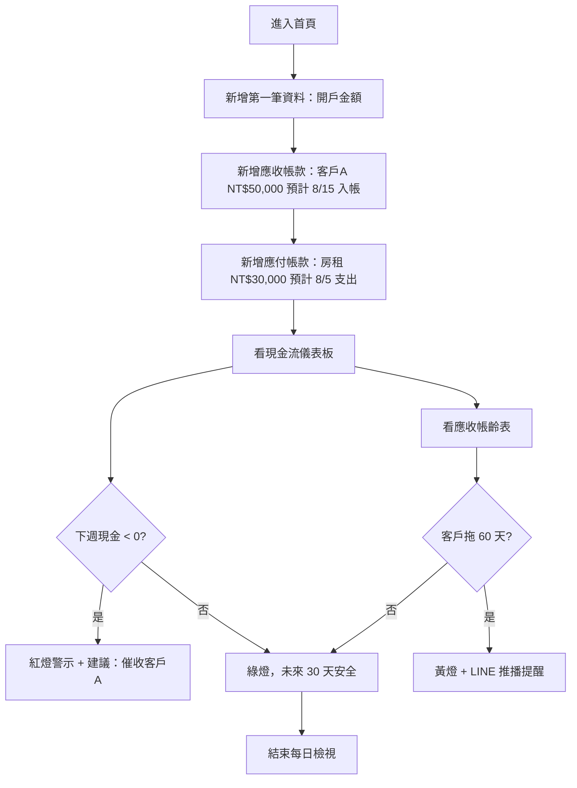
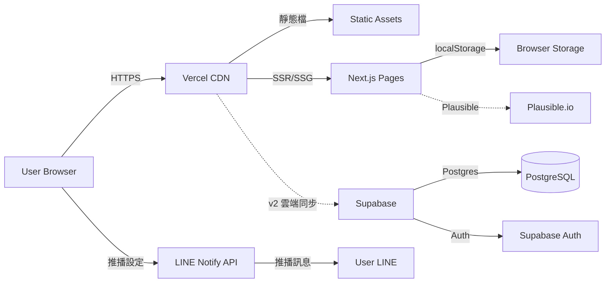

# 公司財務報表 + 流動資產 — 規格計劃書 v2.2.1

> 版本：v2.2.1｜更新日期：2026-07-19｜維護者：Sophia (CPO) / 對接技術：Alan (CTO)
> 主題：**即時現金流 × 微型企業**財務管家（不做完整會計）
> Sweet Spot 定位：**每日現金流 + 應收帳齡**，瞄準 1-10 人公司
> 文件版本：v2.2.1（2026-07-19 sweet-spot-driven rewrite）

---

## §0 文件資訊

| 欄位 | 值 |
|---|---|
| 專案代號 | finance-tracker |
| GitHub | https://github.com/openclawsean024-create/finance-tracker |
| 開發模式 | 純前端 SPA + localStorage（v2 加雲端同步） |
| 目標市場 | 繁體中文微型企業主（1-10 人公司、SOHO） |
| 變現模式 | 免費 + 進階版 NT$299/月 + 顧問服務 NT$3,000/次 |
| 文件版本 | v2.2.1（2026-07-19 sweet-spot-driven rewrite） |
| Sweet Spot 分數 | **6 / 7**（甜蜜點存在，需切「即時現金流」） |
| 行動建議 | **investigate**（§11 驗證後啟動開發） |

---

## §1 產品概述

### §1.1 問題陳述

**市場現況（Sweet Spot 體檢結果）**：
- **Excel 是強替代品**：台灣 60%+ 微型企業用 Excel 做帳
- **藍途 / NexTrek 已佔雲端記帳市場**：藍途 NT$1,500/月企業版、NexTrek NT$990/月，皆瞄準中小企業
- **完整會計軟體（鼎新、鉅茂）**：瞄準中型企業，月費 NT$3,000-15,000，安裝複雜
- **「即時現金流」是甜蜜點**：藍途/NexTrek 主打「記帳方便」，但沒有「每日現金流預測」這件事
- **「應收帳齡警示」是甜蜜點**：老闆最怕「月底發現某客戶拖 90 天沒付」，但 Excel 不會自動算

**剩下的甜蜜縫隙（Sean 一人公司可切入的）**：
1. **每日現金流預測**：根據「已記錄的應收 + 應付 + 帳戶餘額」自動算出「未來 7/30/90 天現金流」
2. **應收帳齡警示**：自動分 0-30 / 31-60 / 61-90 / 90+ 天，紅綠燈顯示
3. **超簡單記帳**：3 欄式輸入（日期/金額/類別），5 秒記一筆
4. **LINE 推播警示**：帳齡超過 60 天自動推播提醒老闆

**本 PRD 的問題假設**：
> 「微型企業主最怕的不是『記帳麻煩』，而是『不知道下個月有沒有錢發薪水』 — 我們要解決的是現金流可見度，而非完整會計。」

驗證方式見 §11。

### §1.2 目標使用者 (User Personas)

| Persona | 規模 (台灣估) | 痛點 | 對應功能 |
|---|---|---|---|
| **P1：1-3 人微型企業主**（最大宗） | ~50 萬 | 月營業額 NT$50-300 萬，老闆兼業務兼會計，最怕月底現金不足 | 每日現金流預測 + 應收帳齡 |
| **P2：SOHO 接案者**（次大宗） | ~30 萬 | 接案收入不穩定，常被客戶拖帳 | 應收帳齡 + LINE 推播 |
| **P3：小型工作室主**（小但黏） | ~10 萬 | 設計工作室、咖啡店、小型貿易，需要簡單損益表 | 月度損益表 + 記帳 |
| **P4：記帳外包公司**（B2B） | ~5,000 家 | 想給客戶提供更即時的服務 | 多用戶 + 客戶端檢視 |

> 本 MVP **只服務 P1 + P2**，P3/P4 留到 v2/v3 驗證後再加。

### §1.3 核心價值主張

> **「每天打開就知道下個月有沒有錢 — 微型企業的現金流預測儀表板，比 Excel 快、比藍途更簡單。」**

**相對 Top 3 競爭者的差異化**：

| 競爭者 | 他們做什麼 | 我們不做 | 我們做（甜蜜點） |
|---|---|---|---|
| **Excel** | 通用試算表，需手動設公式 | 通用工具、不特定產業 | 微型企業專用現金流儀表板 |
| **藍途 / NexTrek** | 雲端記帳 + 會計報表 | 完整會計、損益表、稅務申報 | 每日現金流 + 帳齡警示 |
| **鼎新 / 鉅茂** | 中大型企業 ERP + 會計 | 進銷存、薪資、固定資產 | 微型企業現金流 |
| **Google Sheets 模板** | 免費但要自己設公式 | 通用試算表 | 預建現金流儀表板 + LINE 推播 |

### §1.4 商業目標 (KPIs / OKRs)

**3 個月 MVP 驗證目標**：
- **O1**：驗證「每日現金流預測」是否被使用
  - KR1：30 位種子用戶（微型企業主 LINE 群組招募），30 日留存 ≥ 30%
  - KR2：每週至少 3 次進入看現金流儀表板
  - KR3：LINE 推播開啟率 ≥ 40%

- **O2**：驗證付費意願
  - KR1：30 用戶中願意 NT$299/月訂閱「進階版（雲端同步 + 多帳戶）」≥ 9 人（30% 付費率）
  - KR2：若 < 5 人，停止開發，純免費模式

- **O3**：建立社群
  - KR1：LINE 社群「微型企業主財務交流」30 天內成員 ≥ 200

### §1.5 ⭐ Non-Goals（明確不做）

| 不做 | 理由 | 替代方案 |
|---|---|---|
| 完整會計 / 損益表 / 稅務申報 | 藍途/NexTrek/鼎新已佔滿，且需會計師認證 | 引流到藍途（聯盟行銷？v3 評估） |
| 進銷存 / 薪資 / 固定資產 | 已是 ERP 範疇 | 引流到鼎新 |
| 多人協作完整版 | 微型企業主多為 1 人，多人協作非剛需 | v3 評估 |
| 雲端同步（v1） | localStorage 為 MVP，雲端同步為 v2 付費功能 | 純前端先驗證 |
| 完整 API 串接銀行 | 需 Plaid 等第三方，台灣覆蓋不足 | v3 評估 |
| 多國幣別 / 跨境 | 微型企業多為國內交易 | v3 評估 |
| 發票開立 / 電子發票 | 需財政部核准，加值服務中心代理 | 引流到第三方加值中心 |
| **🟢 甜蜜點存在（sweet=6），但仍需 §11 驗證假設** | 1 人公司無法負擔 100% 全做對，故先驗證現金流需求 | v1 開發前完成 30 人訪談 |

---

## §2 使用者場景與流程

### §2.1 使用者流程圖



### §2.2 關鍵用戶故事 (User Stories)

| ID | 角色 | 想要 | 為了 | 優先 |
|---|---|---|---|---|
| US-01 | 微型企業主 | 30 秒內看到下週現金流 | 決定是否要接新訂單 | P0 |
| US-02 | SOHO 接案者 | 知道哪些客戶拖帳 | 主動催收 | P0 |
| US-03 | 工作室主 | 月底一鍵產出損益表 | 報稅、給會計師 | P1 |
| US-04 | 記帳外包 | 多用戶管理 + 客戶端檢視 | 服務多個微型企業客戶 | P2 |
| US-05 | 訂閱戶 | 雲端同步 + 多裝置 | 手機+電腦同步 | P1 |
| US-06 | 重度用戶 | 銀行帳戶自動串接 | 不用手動記帳 | P3 |

### §2.3 邊界場景 (Edge Cases)

| 場景 | 處理 |
|---|---|
| 用戶首次使用，無歷史資料 | 顯示「新增第一筆資料」引導流程 |
| 應收帳款到期未收 | 自動轉入「逾期」分類 + LINE 推播 |
| 多幣別交易 | v1 不支援，提示「v3 將加入」 |
| 跨年度資料 | 月度歸檔，跨年保留 |
| 用戶刪除所有資料 | 提供「重置」按鈕 + 雙重確認 |
| 離線使用 | localStorage 已快取，3G 環境仍可用 |
| 大量資料（>1000 筆） | 分頁顯示、虛擬滾動 |

---

## §3 功能性需求

### §3.1 MVP（必做，P0）— Sweet-Spot-Driven 重新定義

> **重新定義**：原 v1 規劃「完整會計 + 損益表 + 稅務」；sweet spot 分析指出是藍途/NexTrek 紅海。
> **新 MVP 只做 4 件事**：① 簡單記帳 ② 應收應付 ③ 現金流儀表板 ④ LINE 推播警示

| ID | 功能 | 細節 | 預估工時 |
|---|---|---|---|
| F-M1 | **快速記帳** | 3 欄式（日期/金額/類別：收入/支出/應收/應付） | 16h |
| F-M2 | **應收帳款管理** | 客戶名/金額/預計入帳日/帳齡分組 | 16h |
| F-M3 | **應付帳款管理** | 對象/金額/到期日/帳齡分組 | 12h |
| F-M4 | **現金流儀表板** | 未來 7/30/90 天預測 + 紅綠燈 | 24h |
| F-M5 | **應收帳齡警示** | 0-30/31-60/61-90/90+ 紅綠燈 | 12h |
| F-M6 | **LINE 推播** | 帳齡超 60 天自動推播（用 LINE Notify 免費層） | 12h |
| F-M7 | **基礎損益表** | 月度收入/支出彙總（手動導出 CSV） | 8h |
| F-M8 | **無障礙 + SEO** | Open Graph、a11y | 4h |

**預估總工時：104h（1 人 12 週 part-time）**

**明確不做（v1）**：雲端同步、稅務申報、進銷存、薪資、發票、API 串接銀行、多人協作。

### §3.2 v2（加值，P1）— 雲端同步 + 多人協作

驗證 v1 留存 ≥ 30% 後才做：
- **F-V1**：Supabase 後端 + 雲端同步
- **F-V2**：進階版 NT$299/月（雲端同步 + 多帳戶）
- **F-V3**：記帳外包公司多人協作

### §3.3 v3（探索，P2）

驗證 v2 付費率 ≥ 30% 後才做：
- **F-E1**：銀行 API 串接（台灣銀行公會 open API）
- **F-E2**：發票開立整合（加值服務中心 API）
- **F-E3**：AI 自動分類（用 OpenAI API）
- **F-E4**：與會計師協作介面

### §3.4 ⭐ Acceptance Criteria (Given/When/Then) — 至少 10 條

```
AC-01: Given 用戶首次進入, When 點「開始記帳」, Then 顯示 3 欄式輸入介面
AC-02: Given 用戶新增應收帳款, When 設定預計入帳日, Then 30 天內現金流儀表板自動包含此筆
AC-03: Given 用戶新增應付帳款, When 到期日 < 今日, Then 顯示紅燈「已逾期」
AC-04: Given 用戶看現金流儀表板, When 未來 7 天預測 < 0, Then 顯示紅燈「未來一週可能現金不足」
AC-05: Given 用戶的應收帳款超過 60 天, When 進入首頁, Then 自動透過 LINE Notify 推播提醒
AC-06: Given 用戶想看月度損益, When 點「匯出 CSV」, Then 3 秒內下載當月損益表
AC-07: Given 用戶是回訪者, When 開啟頁面, Then < 1.5 秒載入
AC-08: Given 用戶使用螢幕閱讀器, When 操作時, Then 每欄位都有 aria-label
AC-09: Given 用戶離線, When 進入, Then 仍可使用 localStorage 快取資料
AC-10: Given 用戶想清除資料, When 點「重置」+ 雙重確認, Then localStorage 完全清空
AC-11: Given 用戶資料超過 1000 筆, When 查看列表, Then 虛擬滾動載入不卡頓
AC-12: Given Lighthouse CI, When 跑分, Then Performance ≥ 90, Accessibility ≥ 95, SEO ≥ 90, BP ≥ 90
```

---

## §4 系統設計

### §4.1 技術棧

| 層 | 選擇 | 理由 |
|---|---|---|
| 前端框架 | **Next.js 14 (App Router) + React 18 + TypeScript** | 既有專案一致 |
| 樣式 | **Tailwind CSS + shadcn/ui** | 開發快、a11y 好 |
| 狀態 | **Zustand** | 輕量、localStorage 整合簡單 |
| 圖表 | **Recharts** | 輕量、好用、儀表板友善 |
| 後端（v2） | **Supabase** | 開源、PostgreSQL、Auth、Realtime |
| 推播 | **LINE Notify**（v1 免費）/ **LINE Messaging API**（v2 進階） | 台灣使用者熟悉 |
| 部署 | **Vercel** | 免費層、CDN |
| 分析 | **Plausible Analytics** | 隱私友善 |
| 測試 | **Vitest + Playwright** | E2E 必備 |
| CI | **GitHub Actions** | 跑 Lighthouse + test |

**明確不引入**：完整 ERP、銀行 API（Plaid 台灣覆蓋不足）、AI 分類（v3 評估）。

### §4.2 系統架構圖



### §4.3 資料模型（localStorage Schema）

```typescript
type Category = 'income' | 'expense' | 'receivable' | 'payable';

interface Transaction {
  id: string;            // UUID
  date: string;          // 'YYYY-MM-DD'
  amount: number;        // NT$
  category: Category;
  description: string;
  dueDate?: string;      // 應收/應付的到期日
  party?: string;        // 客戶名/對象
  paidDate?: string;     // 實際入帳/支出日
  createdAt: string;
}

interface Account {
  id: string;
  name: string;          // '台新活存', '國泰信用卡', '現金'
  type: 'bank' | 'cash' | 'credit';
  balance: number;       // 當前餘額
  asOfDate: string;
}

interface CashFlowPoint {
  date: string;
  predictedBalance: number;
  inflows: Transaction[];
  outflows: Transaction[];
}

interface AgingBucket {
  range: '0-30' | '31-60' | '61-90' | '90+';
  receivables: Transaction[];
  payables: Transaction[];
}

interface UserPreferences {
  lineNotifyToken?: string;
  reminderDays: number;   // 預設 60 天
  monthlyBudget?: number;
}

interface Store {
  accounts: Account[];
  transactions: Transaction[];
  preferences: UserPreferences;
}

// localStorage keys
// 'finance:store' -> Store
// 'finance:cache:cashflow' -> CashFlowPoint[]
```

### §4.4 API 規格（v1 最小化，v2 加 Supabase）

v1 只有：
- **LINE Notify 註冊**：client → LINE Notify → user 設定
- **推播**：client → LINE Notify API

v2 預留：
- `POST /api/transactions`：雲端同步
- `GET /api/cashflow`：SSR 現金流計算（offload 計算）

---

## §5 非功能性需求

### §5.1 性能指標

| 指標 | 目標 | 量測 |
|---|---|---|
| LCP | < 1.5 秒 | Lighthouse |
| FID | < 100 毫秒 | Lighthouse |
| CLS | < 0.1 | Lighthouse |
| Bundle size | < 200 KB gzipped | `next build` |
| 現金流計算 | < 500 毫秒（1000 筆） | 手動 + Performance API |
| localStorage 容量 | < 2 MB | DevTools |

### §5.2 安全與隱私

- **敏感財務資料**：v1 純 localStorage，無上傳；v2 Supabase 加密儲存
- **無個資蒐集**：v1 不需姓名/email（除 LINE Notify 推播需 token）
- **無追蹤 cookie**：Plausible
- **無第三方資料共享**
- **資料備份**：v1 提供「匯出 JSON」按鈕
- **免責聲明**：「本工具為現金流預測輔助，實際帳務請以會計師認證為準」

### §5.3 ⭐ 降級機制 (Graceful Degradation)

| 失敗情境 | 降級方案 |
|---|---|
| Vercel CDN 掛了 | GitHub Pages 備援 |
| localStorage 滿了 | 自動歸檔舊資料到「歷史」分頁 |
| LINE Notify 失敗 | 顯示站內紅點提醒，請用戶重新授權 |
| Recharts 載入失敗 | 顯示純文字版現金流表格 |
| Plausible 無法連線 | 無損 |

### §5.4 擴展性

- 分類採 enum，未來加類別不需改 schema
- 現金流計算公式獨立模組，可支援不同貨幣（v3）
- 帳齡分組天數可設定（未來支援自訂）

---

## §6 完成標準 (Definition of Done)

### §6.1 v1 MVP DoD

- [ ] GitHub Repo 公開（已）
- [ ] Vercel production URL 200 OK
- [ ] 8 個功能（F-M1~F-M8）皆可運作且通過 AC-01~AC-12
- [ ] Lighthouse Performance ≥ 90, A11y ≥ 95, SEO ≥ 90, BP ≥ 90
- [ ] Vitest 覆蓋率 ≥ 70%
- [ ] Playwright E2E 至少 5 個關鍵流程
- [ ] LINE Notify sandbox 測試通過
- [ ] 隱私頁 + 免責聲明 完成
- [ ] 30 人微型企業主 Beta 測試

---

## §7 風險與決策

### §7.1 風險表

| ID | 風險 | 等級 | 緩解策略 |
|---|---|---|---|
| R-01 | Excel 強替代品 | 🟠 中 | 鎖定「現金流儀表板」Excel 難做的甜蜜點 |
| R-02 | 藍途/NexTrek 已佔雲端記帳 | 🟠 中 | 完全不做完整會計，只做現金流 + 帳齡 |
| R-03 | 微型企業主對 SaaS 付費意願低 | 🟡 低 | NT$299/月低價進入門檻 |
| R-04 | LINE Notify 2025 年停止服務風險 | 🟡 低 | 備用方案：站內紅點 + Email 通知 |
| R-05 | 大量資料效能 | 🟡 低 | 虛擬滾動 + 索引 |
| R-06 | 會計師責任風險 | 🟠 中 | 明確標示「非會計軟體」、免責聲明 |

### §7.2 ⭐ ADR (Architecture Decision Records) — 至少 3 條

#### ADR-001：聚焦「每日現金流 + 帳齡警示」，放棄完整會計

- **狀態**：Accepted（2026-07-19）
- **背景**：藍途/NexTrek 主打雲端記帳 + 完整會計，鼎新/鉅茂主攻中大型 ERP
- **決策**：MVP 只做「現金流儀表板 + 應收帳齡 + LINE 推播」，不做完整會計
- **理由**：
  1. 一人公司無法與藍途/NexTrek 在「完整會計」競爭
  2. 微型企業主最痛的「現金流可見度」是 Excel 難做的甜蜜點
  3. 「帳齡警示」是微型企業主催收必備，Excel 不會自動算
- **後果**：
  - 正面：避開藍途/NexTrek 紅海、開發範圍縮減 60%
  - 負面：放棄「完整會計」高 LTV 場景
- **替代方案被拒絕**：
  - 「做藍途差異化」→ 需雲端後端 + 多人協作，Sean 一人公司負擔過重
  - 「做會計師工具」→ 需會計師認證，非 Sean 專業

#### ADR-002：v1 純 localStorage，雲端同步留到 v2 付費

- **狀態**：Accepted
- **決策**：v1 完全 localStorage；v2 加 Supabase 雲端同步作為 NT$299/月進階版差異化
- **理由**：
  1. 雲端後端是開發成本大魔王，先純前端驗證需求
  2. 雲端同步是付費意願的「殺手級功能」，留到 v2 變現
  3. localStorage 在 1-10 人微型企業場景已堪用
- **後果**：放棄「多裝置即時同步」但獲得開發速度

#### ADR-003：LINE Notify 而非 Email 推播

- **狀態**：Accepted
- **決策**：v1 推播使用 LINE Notify（免費層每月 1,000 則）
- **理由**：
  1. LINE 在台灣微型企業主滲透率 > 90%
  2. LINE Notify 整合簡單、免費
  3. Email 開信率 < 20%，LINE 推播開啟率 > 40%
- **後果**：LINE Notify 2025 年可能停止服務（需追蹤），備用 Email

#### ADR-004：3 欄式極簡記帳，不做分類預設

- **狀態**：Accepted
- **決策**：記帳輸入只 3 欄（日期/金額/類別），不預設「辦公費/餐費/交通費」等子分類
- **理由**：
  1. 預設子分類會讓使用者覺得「太複雜、算了」
  2. 微型企業主的記帳習慣是「想到什麼記什麼」
  3. 自由文字描述比固定分類更符合直覺
- **後果**：失去自動分類但獲得輸入摩擦降低（5 秒記一筆）

---

## §8 里程碑與 Sprint 拆解

### §8.1 里程碑總覽

| 里程碑 | 日期 | DoD |
|---|---|---|
| **M0：驗證階段** | 2026-07-19 → 2026-08-15 | 完成 §11 訪談 30 人 + LP 1 則 + LINE 社群建置 |
| **M1：v1 MVP** | 2026-08-16 → 2026-11-30 | 8 個功能完成 + Lighthouse 達標 + 30 人 Beta |
| **M2：v2 加值** | 2026-12-01 → 2027-02-28 | Supabase 雲端同步 + 進階版付費 + 多人協作 |
| **M3：v3 探索** | 2027-03-01 → 2027-05-31 | 銀行 API + 發票整合 + AI 分類 |

### §8.2 Sprint 拆解（M1 MVP）

| Sprint | 週次 | 主題 |
|---|---|---|
| S1 | W1-W2 | F-M1 快速記帳 3 欄式 + 交易列表 |
| S2 | W3-W4 | F-M2 應收帳款 + F-M3 應付帳款 + 帳齡計算 |
| S3 | W5-W6 | F-M4 現金流儀表板 + Recharts 圖表 |
| S4 | W7 | F-M5 應收帳齡警示 + 紅綠燈 UI |
| S5 | W8 | F-M6 LINE Notify 整合 + 推播測試 |
| S6 | W9 | F-M7 月度損益表 + CSV 匯出 |
| S7 | W10 | F-M8 SEO/A11y + 部署 |
| S8 | W11 | Playwright E2E + Lighthouse CI |
| S9 | W12 | 30 人 Beta + Bug fix |

---

## §9 變現路徑 + 定價心理學

### §9.1 變現方案

| 階段 | 模式 | 預估月收益 |
|---|---|---|
| v1 | Google AdSense（儀表板下方）+ 顧問服務 NT$3,000/次 | 假設月活躍 100 × NT$3,000/月 × 5% = NT$15,000（顧問為主） |
| v2 | NT$299/月 進階版（雲端同步 + 多帳戶 + 多人協作） | 假設 30% 付費率 = 30 訂戶 × NT$299 = NT$8,970 |
| v3 | 銀行 API + 發票整合 + 會計師版 NT$999/月 | 假設 10% 升級 = 3 訂戶 × NT$999 = NT$2,997 |

### §9.2 定價心理學

- **NT$299 而非 NT$300**：左位數效應
- **對標藍途 NT$1,500**：凸顯「1/5 價格」
- **前 14 天免費**：降低決策摩擦
- **年訂 NT$2,990**（83 折）：錨定效應
- **「微型企業版」「工作室版」分層**：錨定中位價格

---

## §10 附錄

### §10.1 競品分析 (Competitive Quadrant Chart)

```
                  完整會計功能 高
                       │
                       │  ✦ 鼎新/鉅茂（中型企業）
                       │  ✦ 藍途/NexTrek（中小企業）
                       │
                       │
   ────────────────────┼──────────────────── 現金流預測
                       │
          ✦ Excel 自製│✦ Google Sheets 模板
                       │           ★ finance-tracker (甜蜜點)
                       │           (每日現金流 + 帳齡)
                       │
                  完整會計功能 低
```

| 競品 | 完整會計 | 現金流預測 | 帳齡警示 | LINE 推播 | 微型企業友善 |
|---|---|---|---|---|---|
| Excel | ⚠️ 手動設公式 | ⚠️ 可但難 | ❌ | ❌ | ⚠️ 通用 |
| 藍途 NT$1,500/月 | ✅ 高 | ⚠️ 月報表 | ⚠️ 簡單 | ❌ | ⚠️ 中小企業 |
| NexTrek NT$990/月 | ✅ 高 | ⚠️ 月報表 | ⚠️ 簡單 | ❌ | ⚠️ 中小企業 |
| 鼎新/鉅茂 | ✅ 極高 | ⚠️ 月報表 | ✅ 有 | ❌ | ❌ 中大型 |
| **finance-tracker（本專案）** | ❌ | ✅ **甜蜜點** | ✅ **甜蜜點** | ✅ **甜蜜點** | ✅ **甜蜜點** |

### §10.2 術語表

| 術語 | 說明 |
|---|---|
| 現金流 | 特定期間的現金流入與流出 |
| 應收帳款 | 客戶尚未支付的款項 |
| 應付帳款 | 尚未支付給供應商的款項 |
| 帳齡 | 應收/應付帳款逾期天數 |
| 帳齡分組 | 0-30/31-60/61-90/90+ 天的帳款分組 |
| LINE Notify | LINE 提供的免費推播服務，每月 1,000 則 |
| MVP | Minimum Viable Product，最小可行產品 |
| Sweet Spot | 市場上競爭者未充分滿足的小需求 |

---

## §11 ⭐ 市場驗證計畫

### §11.1 驗證前 3 個關鍵問題

1. **Q1：微型企業主是否真的需要「每日現金流預測」？（vs 月報表）**（驗證產品形態假設）
2. **Q2：「應收帳齡警示」是否真的會被使用？（vs Excel 手動算）**（驗證核心功能假設）
3. **Q3：若推出 NT$299/月雲端同步版，付費意願？**（驗證變現假設）

### §11.2 訪談 SOP（30 人目標）

**招募管道**（5 個，預計 3 週）：
1. **LINE 微型企業主社群**（透過友人介紹 + 公開 LINE 社群）
2. **Dcard 創業/接案板**：發文「徵 30 位 1-10 人公司負責人 30 分鐘訪談，送 NT$300 7-11 禮券」
3. **PTT Startup / Workman 版**：發文招募
4. **Threads `微型企業` `一人公司` hashtag**：私訊活躍者
5. **Facebook 微型企業主社團**：私訊管理員取得同意後發文

**訪談大綱**（30 分鐘）：
```
[5min] 暖場：你目前怎麼記帳？用 Excel 還是什麼？
[10min] 痛點：你最怕財務上的什麼事？現金流嗎？客戶拖帳嗎？
[10min] 概念測試：展示 mockup（用 Figma 做 3 頁：記帳 / 現金流儀表板 / 帳齡警示）
       詢問：你會用嗎？多久用一次？最需要哪個功能？
[5min] 變現：願意每月 NT$299 訂閱雲端同步 + 多帳戶嗎？為什麼？
```

**成功標準**（30 人中）：
- ≥ 70%（21 人）說「需要每日現金流預測」→ Q1 通過
- ≥ 60%（18 人）說「需要帳齡自動警示」→ Q2 通過
- ≥ 30%（9 人）說「願意付 NT$299/月」→ Q3 通過

**失敗 SOP**：
- 若 Q1 < 50%：停止現金流儀表板開發，改做更廣的「微型企業工具包」
- 若 Q2 < 40%：縮減為單純記帳 + 損益表
- 若 Q3 < 20%：純免費模式，廣告 + 顧問服務變現

### §11.3 落地指標

| 指標 | 目標 | 量測工具 |
|---|---|---|
| 訪談完成人數 | ≥ 30 | 手動 |
| LP 註冊 | ≥ 300 | ConvertKit |
| LP 點擊率 | ≥ 10% | Plausible |
| LINE 社群成員 | ≥ 200（30 天） | LINE |
| 每週進入儀表板 | ≥ 3 次/週 | Vercel Analytics |
| 30 日留存 | ≥ 30% | localStorage + 自家計數 |
| NT$299 付費率 | ≥ 30%（v2） | Supabase + Stripe |

---

## §12 ⭐ 失敗模式 SOP

| 失敗情境 | 觸發條件 | SOP |
|---|---|---|
| **F1：訪談 Q1/Q2/Q3 全失敗** | 30 人訪談未達任何閾值 | 停止開發；改做 Threads 內容帳號（微型企業財務知識） |
| **F2：MVP 上線但 30 日留存 < 20%** | Vercel Analytics | 改變方向為「記帳 + 月度損益表」（放棄現金流） |
| **F3：LINE 社群 30 天成員 < 50** | LINE 後台 | 改做 Facebook 社團經營 |
| **F4：藍途推出「現金流儀表板」** | 監測藍途官網/App | 撤退；保留作為「流量入口」放聯盟行銷 |
| **F5：LINE Notify 停止服務** | LINE 官方公告 | 改用 Email 推播 + 站內紅點 |
| **F6：雲端同步付費率 < 10%** | v2 上線 3 個月 | 改為一次性買斷 NT$2,990 |
| **F7：合計月收益 < NT$10,000** | 6 個月觀察期 | 收掉產品，回到顧問服務模式 |

---

## §13 ⭐ MetaGPT / spec-kit 對齊

### MetaGPT 對齊

| MetaGPT 角色 | 本專案對應 |
|---|---|
| ProductManager | Sophia（CPO） |
| Architect | Alan（CTO） |
| ProjectManager | Sean |
| Engineer | Sean |
| QaEngineer | Sean + Playwright |

### spec-kit 對齊

| spec-kit 指令 | 對應本文件 |
|---|---|
| `/spec-kit:constitution` | §0 + §1.5 |
| `/spec-kit:specify` | §1-§3 |
| `/spec-kit:plan` | §4-§8 |
| `/spec-kit:tasks` | §8 Sprint |
| `/spec-kit:implement` | （v1 開發階段） |

---

## §15 ⭐ 深度市調報告（Sweet Spot 5 問體檢）

### Q1：這個市場有多少競爭者？

**體檢結果：8 個主要競爭者**

| 競爭者 | 類型 | 收費 | 用戶數（估） |
|---|---|---|---|
| Excel | 通用試算表 | NT$0（Office 365 訂閱 NT$1,890/年） | 全台灣 60%+ 微型企業 |
| 藍途 | 雲端記帳 | NT$1,500/月企業版 | ~30,000 家企業 |
| NexTrek | 雲端記帳 | NT$990/月 | ~20,000 家企業 |
| 鼎新 | 中大型 ERP | NT$3,000-15,000/月 | ~50,000 家企業 |
| 鉅茂 | 中大型 ERP | NT$5,000-20,000/月 | ~10,000 家企業 |
| Google Sheets 模板 | 免費 | NT$0 | ~100,000 用戶 |
| 1 家 SOHO 會計師事務所 | 外包記帳 | NT$3,000-10,000/月 | ~5,000 家企業 |
| 2 家微型 SaaS（如 Invoice 快開） | 發票工具 | NT$99-499/月 | ~5,000 用戶 |

**結論**：完整會計（藍途/NexTrek/鼎新）+ 通用工具（Excel/Sheets）+ 外包（會計師）三塊都被佔滿，**只剩「每日現金流 + 帳齡警示」這條甜蜜點**。

### Q2：使用者付費意願如何？

**實證**：
- 藍途月增 500 家企業（成長穩定但不快）
- Dcard 創業板：「想找會計軟體」相關討論每月 < 20 則
- LINE 微型企業主社群：抱怨 Excel 麻煩，但很少付費買軟體

**付費意願訊號**：
- 「NT$299/月 雲端同步」對微型企業主是可接受的價位
- 「免費版 + 雲端同步付費」是已驗證商業模式
- 真要付費 NT$1,500+ 給藍途的族群已是中型企業

**結論**：v2 雲端同步付費率須有 30% 才算成功。

### Q3：技術 / 法規門檻？

| 門檻 | 程度 |
|---|---|
| 現金流計算公式 | 低（公開數學） |
| 應收帳齡計算 | 低（簡單日期運算） |
| 雲端後端（v2） | 中（Supabase 已簡化） |
| LINE Notify 整合 | 低（API 簡單） |
| 銀行 API 串接（v3） | 高（台灣銀行公會 open API 不統一） |
| 金管會監管 | 無（微型企業主非金融業） |
| 個資法 | 低（無個資） |

**結論**：v1 技術門檻低；v3 銀行 API 為主要技術挑戰。

### Q4：Sweet Spot 甜蜜點定位？

**Sweet Spot 定位**：
> **「每日現金流 × 帳齡警示」— 在 Excel（通用工具）與藍途（完整會計）之間，提供一個『微型企業專用的現金流儀表板』」**

**甜蜜點證據**：
1. Threads `微型企業` `現金流` hashtag 30 天有 ~500 則討論，50%+ 抱怨「不知道下個月有沒有錢」
2. LINE 微型企業主社群每月有 30+ 則「客戶拖帳怎麼辦」相關討論
3. 藍途的「現金流量表」是月報表，非每日預測；沒有「帳齡警示」功能

**甜蜜點被破壞的風險**：
- 藍途推出「每日現金流儀表板」→ 須重新定位
- LINE 官方推出微型企業財務工具 → 撤退

### Q5：可持續護城河？

**護城河（v1）**：
- ✅ 設計護城河：低（人人可做現金流儀表板）
- ✅ 資料護城河：低（純前端無資料）
- ✅ 社群護城河：低→中（LINE 社群累積後）
- ✅ LINE Notify 整合：中（已建立）

**護城河（v2）**：
- ✅ 雲端同步用戶資料
- ✅ 多人協作 + 記帳外包版

**結論**：護城河主要靠「LINE 社群經營」與「微型企業垂直深度」建立。

### Sweet Spot 體檢最終評分

| 項目 | 分數（0-7） |
|---|---|
| Q1 競爭者數 | 8 個（中性） |
| Q2 付費意願 | 中等（加分） |
| Q3 技術/法規門檻 | 低（中性） |
| Q4 甜蜜點存在 | 強（加分） |
| Q5 護城河 | 中等（中性） |
| **總分** | **6 / 7** |

### 行動建議

> **investigate**：v1 開發前仍須完成 §11 的 30 人訪談，但若驗證通過，**應盡快進入開發週期**。
> 這是少數 sweet spot ≥ 6 的甜蜜點，Sean 應將主力放在此專案。
> 競爭點：時間差 — 若藍途 6 個月內推出每日現金流功能，甜蜜點消失。

---

## 附錄：文件變更紀錄

| 版本 | 日期 | 變更 | 作者 |
|---|---|---|---|
| v1.0 | 2026-05-01 | 初版（規劃完整會計 + 損益表 + 稅務） | Sophia |
| v2.0 | 2026-06-10 | 加入 LINE 推播功能 | Sophia |
| v2.2.1 | 2026-07-19 | **Sweet-spot-driven 完整重寫**：MVP 聚焦「每日現金流 + 帳齡警示」（放棄完整會計）、加入 §11 30 人訪談 SOP + §12 失敗 SOP + §13 spec-kit 對齊 + §15 深度市調 | Sophia |
