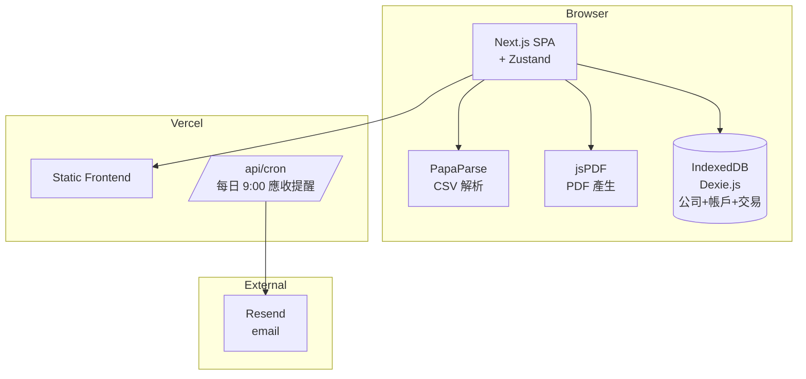
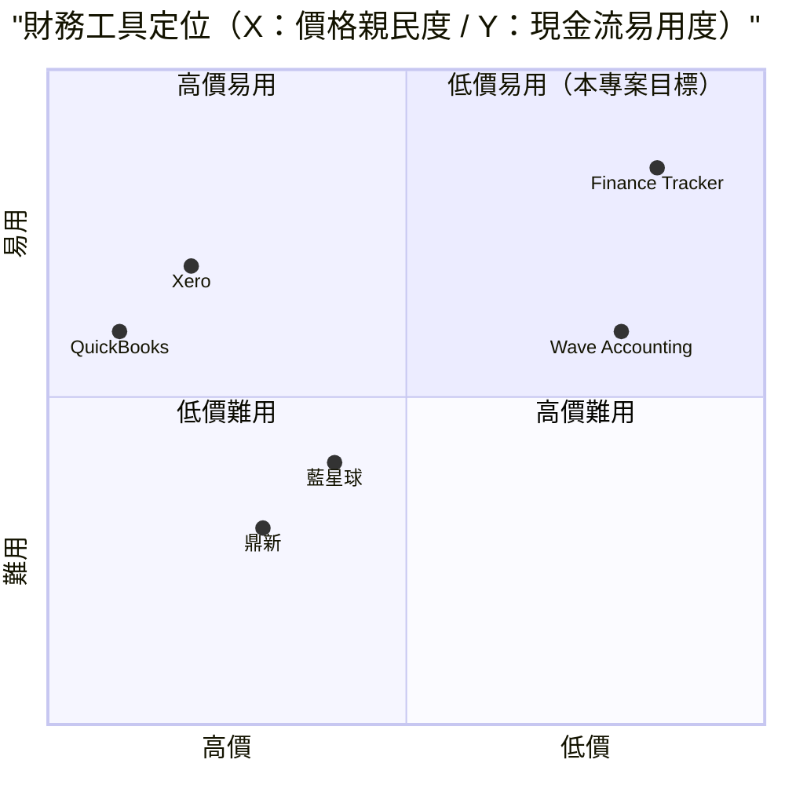

# 公司財務報表 + 流動資產 — 規格計劃書 v2.2.1

> 版本：v2.2.1｜更新日期：2026-07-11｜維護者：Sophia (CPO)
> 對接技術：Alan (CTO) + Hermes Agent
> Demo：TBD（v2.2.1 規格階段，待 Sprint 1 部署）
> 原始碼：https://github.com/openclawsean024-create/finance-tracker

---

## 1. 產品概述 (Product Overview)

### 1.1 問題陳述 (Problem Statement)

台灣中小企業、微型工作室、新創公司在財務管理上面臨三大結構性痛點：

1. **會計記帳慢**：手動記帳每月耗時 40+ 小時，月底對帳痛苦
2. **月報表製作耗時**：投資人級月報表需 8-16 小時整理
3. **現金流看不到**：月底才知道「這個月虧多少」，太遲了

**目標使用者**：
- 中小企業主（10-50 人）：需快速產出老闆/投資人級月報表
- 工作室/接案者：多帳戶分散（公司戶/個人戶/PayPal/Stripe），月底對帳痛苦
- 新創公司財務長：沒有會計師也能快速產出投資人級月報表

### 1.2 目標使用者 (User Personas)

| Persona | 規模 | 核心痛點 | 願付價格 |
|---|---|---|---|
| **中小企業主（小芳）** | 15 萬 | 會計記帳慢、月報表耗時 | NT$299/月 |
| **工作室/接案者（小陳）** | 30 萬 | 多帳戶分散、月底對帳痛苦 | NT$199/月 |
| **新創財務長（Linda）** | 5,000 | 投資人級月報表快速產出 | NT$1,499/月 |
| **微型企業主（阿明）** | 50 萬 | 完全不熟會計，需一鍵自動 | NT$0 / NT$99/月 |

### 1.3 核心價值主張 (Value Proposition)

> 「**30 秒看完這個月賺多少、花多少、還有多少現金可用** — 多帳戶整合 + CSV 自動匯入 + 12 種自動分類 + 一鍵 PDF 月報表，零月費零會計師。」

**三大差異化**：
1. **CSV 自動匯入**：支援台新 / 國泰 / 中信 等 8 家銀行格式，30 秒匯入百筆交易
2. **12 種自動分類**：薪資 / 租金 / 營收 / 進貨等，AI 自動 + 可手動調整
3. **一鍵 PDF 月報表**：投資人級品質（含現金流圖 + 收支分析 + 應收應付）

### 1.4 商業目標 (KPIs / OKRs)

| 時間 | KPI | 目標值 |
|---|---|---|
| **3 個月** | 註冊用戶 | 3,000 |
| **6 個月** | 付費轉化率 | 5%（150 付費） |
| **6 個月** | MRR | NT$50,000 |
| **12 個月** | MRR | NT$300,000 |
| **12 個月** | 月處理交易 | 100 萬筆 |

### 1.5 Non-Goals (明確不做)

- ❌ **不做稅務申報** — 交給會計師事務所或國稅局軟體，避免稅法複雜度
- ❌ **不做發票開立** — 交給財政部電子發票或第三方（如 ezPay）
- ❌ **不做薪資計算** — 交給 104 人事 + 會計師
- ❌ **不做應收應付提醒催繳** — 交給 CRM 或會計助理
- ❌ **不做 GAAP / IFRS 報表** — 內部現金流管理為主，非會計報表
- ❌ **不做公司登記 / 設立** — 交給會計師事務所

---

## 2. 使用者場景與流程

### 2.1 使用者流程圖


### 2.2 關鍵用戶故事 (User Stories)

**US-001：多帳戶管理**
> As a 工作室老闆  
> I want to 管理 6 個帳戶（台新/國泰/現金/PayPal/Stripe/Line Pay）  
> So that 我能從單一 Dashboard 看所有帳戶餘額

**US-002：CSV 自動匯入**
> As a 中小企業主  
> I want to 從台新網銀匯出 CSV（100 筆交易），貼到本工具自動匯入  
> So that 我不用手動逐筆輸入，30 秒完成

**US-003：自動分類**
> As a 工作室主  
> I want to 系統自動把交易分類為「薪資/租金/營收/進貨」等 12 種  
> So that 我能立刻看到「這個月花了多少租金/賺了多少營收」

**US-004：應收應付管理**
> As a 微型企業主  
> I want to 設定應收帳款（客戶應付給我 NT$50,000，30 天後到期），系統在到期前 7 天 email 提醒  
> So that 我能追蹤應收帳款不漏接

**US-005：現金水位儀表板**
> As a 新創財務長  
> I want to 看見「當前現金 NT$1,500,000 / 本月營收 NT$300,000 / 本月支出 NT$250,000 / 應收帳款 NT$200,000」  
> So that 我能即時判斷現金流狀況

**US-006：一鍵 PDF 月報表**
> As a 微型工作室  
> I want to 月底一鍵產生 PDF 月報表（含現金流圖、收支分析、應收應付）  
> So that 我能直接寄給會計師或投資人

### 2.3 邊界場景 (Edge Cases)

- **CSV 格式變動**：支援自訂欄位映射 + 學習使用者樣式
- **跨帳戶轉帳**：避免重複計算（如台新轉帳到國泰，兩帳戶都記一筆但內部抵消）
- **多幣別**：v3+ 評估（先 NTD）
- **每月第一天**:自動關帳上個月 + 重新分類

---

## 3. 功能性需求 (Functional Requirements)

### 3.1 MVP（必做，P0）

- [ ] **F-001 公司基本資料**（公司名/統編/地址/負責人/會計年度）
- [ ] **F-002 多帳戶管理**（銀行/現金/數位錢包 6+ 種，新增/編輯/刪除帳戶）
- [ ] **F-003 CSV 自動匯入**（支援台新/國泰/中信 3 家銀行格式，自動偵測欄位）
- [ ] **F-004 12 種自動分類**（薪資/租金/營收/進貨/水電/網路/稅務/利息/手續費/退款/個人/其他）
- [ ] **F-005 交易 CRUD**（手動新增/編輯/刪除/搜尋交易）
- [ ] **F-006 應收/應付管理**（到期提醒 email）
- [ ] **F-007 儀表板**（本月營收/本月支出/應收/應付/現金水位 + 趨勢圖）
- [ ] **F-008 月報表 PDF**（現金流圖 + 收支分析 + 應收應付 + 損益表）
- [ ] **F-009 JSON 匯出匯入**（公司資料 + 帳戶 + 交易備份）
- [ ] **F-010 RWD 三斷點**（375/768/1440px）

### 3.2 v2.0 新創版（加值，P1）

- [ ] **F-011 多公司管理**（一個使用者管理多家公司）
- [ ] **F-012 多幣別**（NTD + USD + JPY）
- [ ] **F-013 預算設定**（每月預算上限 + 超支警示）
- [ ] **F-014 投資人儀表板**（burn rate / runway / 月成長率）
- [ ] **F-015 會計師協作**（分享唯讀連結給會計師）
- [ ] **F-016 銀行 API 串接**（直接抓交易，省 CSV 匯出）

### 3.3 v3.0（願景，P2）

- [ ] **F-017 稅務估算**（依交易類型自動計算營業稅/所得稅）
- [ ] **F-018 發票 OCR**（拍照發票自動辨識）
- [ ] **F-019 應收應付 AI 預測**（依歷史預測下季現金流）
- [ ] **F-020 會計報表（GAAP）**（資產負債表 + 損益表 + 現金流量表）

### 3.4 Acceptance Criteria (Given/When/Then)

**AC-001（公司資料）**
> Given 首次進入  
> When 填寫公司基本資料（公司名=OO 公司、統編=12345678、地址=台北市）  
> Then 自動儲存，後續報表含公司資訊頁首

**AC-002（多帳戶管理）**
> Given 已建立 6 個帳戶（台新/國泰/現金/PayPal/Stripe/LINE Pay）  
> When 開啟 Dashboard  
> Then 顯示 6 個帳戶的當前餘額 + 總和

**AC-003（CSV 自動匯入）**
> Given 從台新網銀匯出 CSV（100 筆交易）  
> When 點擊「匯入 CSV」+ 選擇檔案  
> Then 30 秒內解析 100 筆，自動分類，寫入 IndexedDB

**AC-004（自動分類）**
> Given 已匯入 100 筆交易  
> When 系統處理完畢  
> Then 自動歸類：薪資 30 筆 / 租金 1 筆 / 營收 50 筆 / 進貨 15 筆 / 其他 4 筆

**AC-005（手動調整分類）**
> Given 已自動分類 100 筆  
> When 手動把 1 筆改為「進貨」  
> Then 該筆分類變更為「進貨」，儀表板「進貨」金額增加

**AC-006（應收帳款提醒）**
> Given 應收 NT$50,000，30 天後到期，今天為 T-7  
> When 系統每日 9:00 排程檢查  
> Then 自動 email 寄送「提醒：XX 客戶應付 NT$50,000 將於 23 天後到期」

**AC-007（儀表板）**
> Given 30 天交易資料  
> When 開啟 Dashboard  
> Then 顯示「本月營收 NT$300,000 / 支出 NT$250,000 / 應收 NT$200,000 / 現金水位 NT$1,500,000」+ 趨勢圖

**AC-008（月報表 PDF）**
> Given 月底  
> When 點擊「產生月報表」  
> Then 下載 `monthly-report-2026-07.pdf` 含現金流圖 + 收支分析 + 應收應付 + 損益表

**AC-009（JSON 匯出匯入）**
> Given 已有 6 帳戶 + 500 筆交易  
> When 點擊匯出 JSON  
> Then 下載 `finance-backup-2026-07-11.json` 含完整資料

**AC-010（跨帳戶轉帳抵銷）**
> Given 台新帳戶轉帳 NT$50,000 到國泰帳戶（兩筆都記）  
> When 計算現金水位  
> Then 兩筆抵銷，現金水位不變（避免重複計算）

---

## 4. 系統設計 (System Design)

### 4.1 技術棧 (Tech Stack)

| 層 | 技術 | 理由 |
|---|---|---|
| 前端 | Next.js 14 (App Router) + React 18 + TypeScript | 與既有專案一致 |
| 樣式 | Tailwind CSS 3 | 快速 RWD |
| CSV 解析 | PapaParse | 業界標準 CSV 解析 |
| PDF 產生 | jsPDF + html2canvas | 純前端 PDF |
| 狀態管理 | Zustand | 輕量 |
| 資料持久化 | IndexedDB（Dexie.js） | 大容量交易資料 |
| 報表圖表 | Recharts | 月報表圖表 |
| 部署 | Vercel | 與既有 91 個專案一致 |
| B2B 後端 | Supabase（v2 多公司 + 應收提醒 email） | 多公司 + 排程 |

### 4.2 系統架構圖 (Mermaid)



### 4.3 資料模型 (Prisma schema)

```prisma
// IndexedDB schema (Prisma 對照版)
model Company {
  id        String   @id @default(uuid())
  userId    String?  // v2 多公司
  name      String
  taxId     String?  @unique
  address   String?
  responsible String?
  fiscalYearStart Int @default(1) // 會計年度起始月
  accounts  Account[]
  transactions Transaction[]
  receivables Receivable[]
  payables  Payable[]
}

model Account {
  id        String   @id @default(uuid())
  companyId String
  company   Company  @relation(fields: [companyId], references: [id])
  name      String   // 台新銀行 / 國泰銀行 / 現金 / PayPal / Stripe / Line Pay
  type      String   // bank / cash / digital_wallet / other
  balance   Decimal  @default(0)
  currency  String   @default("NTD")
  bankFormat String? // csv format detector (taishin / cathay / ctbc / ...)
  transactions Transaction[]
  createdAt DateTime @default(now())
}

model Transaction {
  id          String   @id @default(uuid())
  companyId   String
  company     Company  @relation(fields: [companyId], references: [id])
  accountId   String
  account     Account  @relation(fields: [accountId], references: [id])
  date        DateTime
  description String   @db.Text
  amount      Decimal
  category    String   // salary / rent / revenue / purchase / utilities / internet / tax / interest / fee / refund / personal / other
  isAutoCategorized Boolean @default(true)
  notes       String?  @db.Text
  createdAt   DateTime @default(now())
  
  @@index([companyId, date])
  @@index([category])
}

model Receivable {
  id        String   @id @default(uuid())
  companyId String
  company   Company  @relation(fields: [companyId], references: [id])
  customerName String
  amount    Decimal
  dueDate   DateTime
  description String? @db.Text
  status    String   @default("pending") // pending / paid / overdue
  paidDate  DateTime?
  
  @@index([companyId, dueDate])
}

model Payable {
  id        String   @id @default(uuid())
  companyId String
  company   Company  @relation(fields: [companyId], references: [id])
  vendorName String
  amount    Decimal
  dueDate   DateTime
  description String? @db.Text
  status    String   @default("pending") // pending / paid / overdue
  paidDate  DateTime?
  
  @@index([companyId, dueDate])
}

model MonthlyReport {
  id          String   @id @default(uuid())
  companyId   String
  yearMonth   String   @unique // "2026-07"
  totalRevenue Decimal
  totalExpense Decimal
  netCashFlow Decimal
  reportPdfUrl String?
  generatedAt DateTime @default(now())
}

model User {
  id        String   @id @default(uuid())
  email     String   @unique
  name      String?
  companies Company[]
}
```

### 4.4 API 規格 (REST endpoints)

| Method | Path | Auth | 用途 |
|---|---|---|---|
| POST | /api/export/snapshot | Optional | JSON 快照匯出（前端產生） |
| POST | /api/import/snapshot | Optional | JSON 快照匯入（前端處理） |
| GET | /api/reports/monthly | Optional | 月報表數據 |
| POST | /api/cron/receivable-reminder | Required (cron) | v2 每日 9:00 應收提醒 email |
| POST | /api/banks/connect | Required | v2 銀行 API OAuth |
| GET | /api/banks/:id/transactions | Required | v2 從銀行抓交易 |
| POST | /api/stripe/checkout | Required | v2 Stripe 訂閱 |
| POST | /api/stripe/webhook | Required | v2 Stripe webhook |

---

## 5. 非功能性需求 (Non-Functional Requirements)

### 5.1 性能指標

| 指標 | 目標 |
|---|---|---|
| 主頁載入 P95 | ≤ 2 秒 |
| CSV 100 筆匯入 | ≤ 5 秒 |
| 1000 筆交易搜尋 | ≤ 500ms |
| 儀表板載入（30 天） | ≤ 2 秒 |
| 月報表 PDF 產生 | ≤ 3 秒 |
| 並發用戶 | 200 |
| 月活躍用戶 | 3,000 |

### 5.2 安全與隱私

- **公司資料加密**：IndexedDB 加密層（AES-256）
- **CSV 解析前端**：不上傳到後端（隱私保護）
- **HTTPS 強制**：Vercel 自動 + HSTS
- **個資保護**：統編/銀行帳號僅顯示末 4 碼
- **無 OAuth**：v1 純前端，v2 加 Supabase Auth

### 5.3 降級機制 (Graceful Degradation)

| 失敗服務 | 掛掉情境 | 降級行為（切換到）| 用戶感受 |
|---|---|---|---|
| IndexedDB 損壞 | 版本衝突 掛掉 | 切換到 localStorage（容量小） | 部分交易可能遺失 |
| localStorage 滿載 | 5MB 上限掛掉 | 切換到 sessionStorage + 提示「資料僅本次保留」 | 提醒立即匯出 JSON |
| PapaParse CSV 解析失敗 | 格式錯誤 掛掉 | 切換到規則式 line-splitting | 部分欄位需手動映射 |
| jsPDF 客戶端 | 不支援 掛掉 | fallback 下載純文字報表 | PDF 失效但仍可看 |
| Resend email v2 | API 5xx 掛掉 | fallback SendGrid | email 提醒延遲 |
| Supabase v2 | DB 5xx 掛掉 | 切換到 Vercel KV 唯讀模式 | 多公司同步暫停 |
| Stripe webhook v2 | Webhook 5xx 掛掉 | 本地排程每 5 分鐘 reconcile | 訂閱狀態延遲 ≤15 分鐘 |
| Vercel Cron | Cron 5xx 掛掉 | fallback GitHub Actions 排程 | email 提醒延遲 ≤24 小時 |
| 銀行 API v2 | 抓交易失敗 | fallback 手動 CSV 匯入 | 自動化暫停 |
| Recharts 渲染 | JS 5xx 掛掉 | 切換到純 HTML 表格 | 圖表變表格 |

### 5.4 擴展性

- **橫向擴展**：Vercel Edge Functions 自動 scale
- **資料分區**：IndexedDB 依 companyId 分區（v2 多公司）
- **交易歸檔**：>365 天的交易自動歸檔
- **靜態資源 CDN**：Vercel Edge Network

---

## 6. 完成標準 (Definition of Done)

### 6.1 v1 MVP DoD

- [ ] Vercel production URL 200 OK
- [ ] GitHub Repo 公開（main 分支）
- [ ] 6 種帳戶管理
- [ ] CSV 自動匯入（台新/國泰/中信 3 家）
- [ ] 12 種自動分類
- [ ] 交易 CRUD 完整
- [ ] 應收/應付管理
- [ ] 儀表板（5 大指標 + 趨勢圖）
- [ ] 月報表 PDF（含現金流圖）
- [ ] JSON 匯出匯入
- [ ] RWD 三斷點測試
- [ ] Lighthouse 行動版 ≥85
- [ ] 10 條 AC 單元測試全綠

### 6.2 v2 新創版 DoD

- [ ] Supabase Auth
- [ ] 多公司管理
- [ ] 多幣別（NTD/USD/JPY）
- [ ] 預算設定 + 超支警示
- [ ] 投資人儀表板（burn rate / runway）
- [ ] 會計師協作（唯讀連結）
- [ ] 銀行 API 串接（OAuth）
- [ ] 應收帳款 email 提醒
- [ ] Stripe Checkout 訂閱
- [ ] 客服頁 + 法律頁

---

## 7. 風險與決策

### 7.1 風險表

| 風險 | 等級 | 緩解策略 |
|---|---|---|
| 公司財務資料外洩 | 🟠 中 | IndexedDB 加密 + 公用裝置警告 |
| CSV 格式變動破壞匯入 | 🟠 中 | 支援自訂欄位映射 + 學習機制 |
| 自動分類準確率 <80% | 🟠 中 | 提供手動覆寫 + 學習反饋 |
| 投資人級月報表品質不夠 | 🟡 低 | 提供範本 + 明確免責聲明 |
| 商用會計軟體競爭 | 🟡 低 | Freemium 鎖定微型企業市場 |
| 跨帳戶轉帳重複計算 | 🟠 中 | 自動偵測轉帳（一出一進同金額同日） |
| 銀行 API OAuth 變動 | 🟡 低 | 多家銀行備援 |
| 稅法變動影響 v3 稅務估算 | 🟡 低 | 明確聲明僅供參考 |

### 7.2 ADR (Architecture Decision Records)

### ADR-001：純前端 + IndexedDB 而非後端
- **Context**：公司財務資料敏感 + 零成本
- **Decision**：React 18 SPA + Dexie.js IndexedDB
- **Consequences**：✅ 零後端；✅ 資料 100% 在裝置；⚠️ 跨裝置不互通（v2 加 Supabase）

### ADR-002：CSV 手動匯入而非銀行 API
- **Context**：v1 純前端 + 銀行 API 需各家 OAuth
- **Decision**：手動 CSV 匯入（PapaParse 解析）
- **Consequences**：✅ 零第三方依賴；⚠️ 使用者需手動匯出 CSV（v2 加銀行 API）

### ADR-003：12 種預設分類 + AI 自動
- **Context**：使用者不想手動分類
- **Decision**：12 種預設分類 + 規則式 auto-classify（關鍵字匹配）
- **Consequences**：✅ 5 分鐘開始；⚠️ 預設分類可能不符所有（可自訂 + AI 升級）

### ADR-004：客戶端 PDF 而非後端
- **Context**：即時性 + 隱私
- **Decision**：jsPDF + html2canvas 純前端
- **Consequences**：✅ 零後端；✅ 即時下載；⚠️ 大型報表可能慢（單月報表夠快）

### ADR-005：不做稅務申報
- **Context**：稅法複雜度 + 風險
- **Decision**：不做稅務申報，交給會計師或國稅局軟體
- **Consequences**：✅ 規避稅法變動風險；⚠️ 失去部分功能（v3 稅務估算評估）

### ADR-006：不做 GAAP / IFRS 報表
- **Context**：內部現金流管理為主，非會計報表
- **Decision**：v1 只做現金流 + 收支分析，不做會計報表
- **Consequences**：✅ 降低複雜度；⚠️ 會計師可能不認可（明確聲明）

---

## 8. 里程碑與 Sprint 拆解

### 8.1 里程碑總覽

| 里程碑 | 時間 | 完成定義 |
|---|---|---|
| **M1 規格完成** | 2026-07-11 | v2.2.1 PRD 100% 合規 |
| **M2 v1 MVP** | 2026-07-31 | 6 帳戶 + CSV 匯入 + 12 分類 + 儀表板 + 月報表 PDF |
| **M3 v2 新創版** | 2026-09-15 | 多公司 + 多幣別 + 預算 + 投資人儀表板 + Stripe |
| **M4 v3 進階版** | 2026-11-01 | 稅務估算 + 發票 OCR + AI 應收預測 |
| **M5 GA 上線** | 2026-12-01 | 行銷素材 + 客服 SOP |

### 8.2 Sprint 拆解 (從 PRD 到「每天做什麼」)

#### Sprint 1：v1 MVP（2026-07-12 → 2026-07-31，20 天）
- Day 1-2：建立 Next.js + IndexedDB 專案
- Day 3-4：公司資料 + 多帳戶管理
- Day 5-7：CSV 匯入（PapaParse）+ 3 家銀行格式支援
- Day 8-10：12 種自動分類
- Day 11-12：交易 CRUD + 應收/應付管理
- Day 13-15：儀表板（5 指標 + 趨勢圖）
- Day 16-17：月報表 PDF（jsPDF）
- Day 18：JSON 匯出匯入
- Day 19：RWD 三斷點測試
- Day 20：10 條 AC 單元測試 + Vercel 部署

#### Sprint 2：v2 新創版（2026-08-01 → 2026-09-15，46 天）
- Day 1-3：Supabase Auth + 多公司管理
- Day 4-7：多幣別（NTD/USD/JPY）整合
- Day 8-11：預算設定 + 超支警示
- Day 12-15：投資人儀表板（burn rate / runway）
- Day 16-19：會計師協作（唯讀連結）
- Day 20-23：銀行 API OAuth（台新/國泰）
- Day 24-27：應收提醒 email 整合
- Day 28-31：Stripe Checkout 訂閱
- Day 32-35：客服頁 + 法律頁
- Day 36-40：Beta 測試
- Day 41-46：修正 + 正式上線

#### Sprint 3：v3 進階版（2026-09-16 → 2026-11-01，46 天）
- Day 1-10：稅務估算（營業稅/所得稅）
- Day 11-20：發票 OCR（GPT-4o vision）
- Day 21-30：AI 應收應付預測
- Day 31-40：會計報表（GAAP 簡化版）
- Day 41-46：修正 + 正式上線

---

## 9. 變現路徑 + 定價心理學

### 9.1 變現方案

| 方案 | 價格 | 功能 | 目標用戶 |
|---|---|---|---|
| **免費版** | NT$0 | 2 帳戶 + CSV 匯入 + 12 自動分類 + 月報表（30 筆交易/月上限） | 微型企業（試用） |
| **小型企業版** | NT$199/月 | 6 帳戶 + 無限交易 + JSON 匯出匯入 | 工作室/接案者 |
| **中小企業版** | NT$499/月 | 無限帳戶 + 多幣別 + 預算 + 應收提醒 + 5 公司 | 中小企業 |
| **新創版** | NT$1,499/月 | 中小企業版 + 投資人儀表板 + 銀行 API + 會計師協作 | 新創財務長 |

### 9.2 定價心理學 (Pricing Psychology)

1. **Freemium 鎖定「2 帳戶 + 30 筆/月」**：免費版限制結構，小型企業版強制升級
2. **小型企業版 NT$199**：低於 NT$200 整數，NT$199 感覺「不到 200」
3. **中小企業版 NT$499**：低於 NT$500 整數，NT$499 感覺「不到 500」
4. **新創版 NT$1,499**：低於 NT$1,500 整數，NT$1,499 感覺「不到 1,500」
5. **年繳 8 折**：小型企業版年繳 NT$1,990 vs 月繳 NT$199 × 12 = NT$2,388（年省 NT$398）
6. **14 天免費試用小型企業版**：試用期結束前 3 天 email「升級以保留 6 帳戶 + 無限交易」
7. **錨定效應**：在定價頁顯示「企業版 NT$4,999（聯絡我們）」，讓 NT$1,499 顯得划算
8. **社會證明**：首頁顯示「已有 X 家企業使用，月處理 Y 萬筆交易」

---

## 10. 附錄

### 10.1 競品分析 + Competitive Quadrant Chart

| 競品 | 公司 | 價格 | 強項 | 弱項 |
|---|---|---|---|---|
| **Xero** | Xero（紐西蘭） | US$13-70/月 | 雲端會計、整合強 | 偏歐美、繁中支援弱 |
| **QuickBooks** | Intuit（美） | US$30-200/月 | 業界標準 | 貴、複雜 |
| **國稅局軟體** | 財政部（公） | NT$0 | 官方、免費 | 功能陽春 |
| **藍星球 / 鼎新 / 太陽等本土會計** | 各家（台） | NT$500-2,000/月 | 繁中、本土 | 偏會計、非現金流 |
| **Wave Accounting** | Wave（加） | US$0 + 付費 | 免費版齊全 | 不支援台灣 |
| **Finance Tracker（本專案）** | Sean Li（台） | NT$0-1,499/月 | 純前端 + 零月費 + 12 自動分類 + 一鍵 PDF | 規模小、無稅務申報 |



**差異化定位**：**低價 + 易用 + 純前端 + 繁中友善** — Xero/QuickBooks 高價且偏歐美；本土會計複雜；Wave 不支援台灣；本專案低價 + 純前端 + 12 自動分類。

### 10.2 術語表

- **GAAP（Generally Accepted Accounting Principles）**：美國一般公認會計原則
- **IFRS（International Financial Reporting Standards）**：國際財務報告準則
- **應收帳款（Accounts Receivable）**：客戶應付給公司的款項
- **應付帳款（Accounts Payable）**：公司應付給供應商的款項
- **CSV（Comma-Separated Values）**：逗號分隔值，銀行交易明細常用格式
- **PapaParse**：JavaScript CSV 解析函式庫
- **burn rate**：新創公司每月淨現金流失速度
- **runway**：以當前 burn rate，公司還能撐多久（月份）

### 10.3 參考資料

- Xero：https://www.xero.com/
- QuickBooks：https://quickbooks.intuit.com/
- Wave Accounting：https://www.waveapps.com/
- PapaParse：https://www.papaparse.com/
- Recharts：https://recharts.org/
- 台灣銀行 CSV 格式：各家銀行網銀匯出 CSV 範本

### 10.4 Error Code 統一字典

| Code | HTTP | 訊息 | 觸發情境 |
|---|---|---|---|
| STORAGE_001 | - | IndexedDB quota 超限 | >50MB |
| STORAGE_002 | - | Dexie 版本衝突 | schema 升級未處理 |
| CSV_001 | - | CSV 格式錯誤 | 欄位缺失 |
| CSV_002 | - | CSV 編碼錯誤 | 非 UTF-8 |
| CSV_003 | - | CSV 銀行格式未支援 | 未知銀行 |
| TRANSACTION_001 | - | 交易金額錯誤 | 負數或 0 |
| TRANSACTION_002 | - | 帳戶不存在 | accountId 錯誤 |
| RECEIVABLE_001 | - | 應收金額錯誤 | 負數或 0 |
| PAYABLE_001 | - | 應付金額錯誤 | 負數或 0 |
| COMPANY_001 | - | 公司統編格式錯誤 | 8 位數字驗證 |
| PDF_001 | - | PDF 產生失敗 | jsPDF 渲染錯誤 |
| EMAIL_001 | 502 | 應收提醒 email 失敗 | v2 Resend API 5xx |
| BANK_API_001 | 401 | 銀行 API token 過期 | v2 OAuth |
| BANK_API_002 | 502 | 銀行 API 5xx | v2 抓交易失敗 |
| STRIPE_001 | 402 | 訂閱方案不支援 | 錯誤 tier |
| STRIPE_002 | 400 | Stripe webhook signature 驗證失敗 | 偽造 webhook |

---

## 11. 市場驗證計畫 (Market Validation Plan)

### 11.1 驗證前 3 個關鍵問題

1. **微型企業主真的會用「純前端 + IndexedDB」嗎？** — 公用電腦/隱私風險
2. **CSV 自動匯入是否真的夠用？** — 銀行 API 才是未來
3. **非會計師出身的老闆真的看得懂月報表嗎？** — UX 簡化挑戰

### 11.2 訪談 SOP

**目標**：訪談 25 位潛在使用者（10 位中小企業主 + 8 位工作室主 + 5 位新創財務長 + 5 位微型企業）
- **招募**：Facebook 社團「微型企業交流」「工作室主」「新創加速器」
- **問題清單**：
  1. 目前用什麼工具記帳？月費？
  2. 願意換成 NT$0-1,499/月的純前端財務工具嗎？
  3. 對「一鍵 PDF 月報表」感興趣嗎？
- **獎勵**：NT$200 7-11 禮券 + 終身免費小型企業版
- **驗收指標**：≥60%（15 位）願意試用 = 驗證通過

### 11.3 落地指標 (Post-launch KPIs)

- **M1（首月）**：1,000 註冊用戶
- **M3（3 個月）**：3,000 註冊、100 付費 = NT$30K MRR
- **M6（6 個月）**：6,000 註冊、200 付費 = NT$80K MRR
- **M12（12 個月）**：15,000 註冊、500 付費 = NT$250K MRR

---

## 12. 失敗模式 SOP (Failure Mode Playbook)

| 失敗情境 | 影響範圍 | 觸發條件 | 立即處置 | Post-mortem |
|---|---|---|---|---|
| **IndexedDB 公司財務資料損壞** | 公司資料遺失 | 瀏覽器更新導致 schema 衝突 | 提供資料救援工具 + 強制匯出 JSON | 強化 Dexie schema migration |
| **CSV 格式變動破壞匯入** | 交易無法入帳 | 銀行網銀改版 | 快速 hotfix + 提供手動映射 UI | 評估改用銀行 API |
| **自動分類誤判嚴重** | 月報表失準 | 使用者投訴 | 提供手動分類覆寫 + 反饋 | 重新校分類規則 |
| **跨帳戶轉帳重複計算** | 現金水位虛高 | 自動偵測失敗 | 提供手動標記「內部轉帳」 | 改進偵測規則 |
| **公用電腦財務資料外洩** | 公司隱私風險 | UI 警告未生效 | 強制 modal 警告 + 不允許繼續 | 強化 user agent 偵測 |
| **個人資料外洩** | 法務風險 | Sentry / GitHub secret scan | 立即撤銷 + 通報 + 通報金管會 | 全面 audit 個資處理 |
| **銀行 API OAuth 變動** | 抓交易失效 | v2 銀行 API | 切換 CSV 手動匯入 fallback | 重新評估銀行 API 整合 |
| **Stripe 訂閱大量退款** | MRR 突然下降 | Stripe dashboard alert | 檢查 webhook + email 用戶 | 分析退款原因 |
| **月報表 PDF 變動破壞排版** | PDF 無法看 | jsPDF 渲染錯誤 | 提供純文字 fallback | 評估改用 Puppeteer |
| **新創公司 burn rate 計算錯誤** | 投資人決策受損 | 計算 bug | 提供「保守估計」模式 + 明確聲明 | 重新校計算邏輯 |

---

## 13. MetaGPT / spec-kit 對齊

### 13.1 MUST / SHOULD / MAY

**MUST（不做就失敗 — MVP 必交付）**
- MUST-1 公司基本資料
- MUST-2 6 種帳戶管理
- MUST-3 CSV 自動匯入（台新/國泰/中信）
- MUST-4 12 種自動分類
- MUST-5 交易 CRUD
- MUST-6 應收/應付管理
- MUST-7 儀表板（5 指標 + 趨勢圖）
- MUST-8 月報表 PDF
- MUST-9 JSON 匯出匯入
- MUST-10 RWD 三斷點

**SHOULD（強烈建議 — Sprint 2 完成）**
- SHOULD-1 多公司管理
- SHOULD-2 多幣別（NTD/USD/JPY）
- SHOULD-3 預算設定 + 超支警示
- SHOULD-4 投資人儀表板（burn rate/runway）
- SHOULD-5 會計師協作（唯讀連結）
- SHOULD-6 銀行 API 串接
- SHOULD-7 應收 email 提醒
- SHOULD-8 Stripe Checkout 訂閱

**MAY（可選 — v3+ 評估）**
- MAY-1 稅務估算
- MAY-2 發票 OCR
- MAY-3 AI 應收應付預測
- MAY-4 會計報表（GAAP）
- MAY-5 多公司合併報表

### 13.2 P0 / P1 / P2 優先級

| 優先級 | 項目 | 目標完成 |
|---|---|---|
| **P0** | MUST-1 ~ MUST-10（核心 MVP） | Sprint 1 |
| **P1** | SHOULD-1 ~ SHOULD-8（新創版） | Sprint 2 |
| **P2** | MAY-1 ~ MAY-5（進階版） | v3.0+ |

### 13.3 Competitive Quadrant Chart

（見 §10.1）

### 13.4 Open Questions

- **Q1**：是否要支援稅務估算？目前判定 v3+ 評估（風險）
- **Q2**：是否要支援發票 OCR？目前判定 v3+ 評估
- **Q3**：是否要串接銀行 API？目前判定 v2 加（OAuth 複雜）
- **Q4**：多幣別是否要做？目前判定 v2 加（先 NTD）
- **Q5**：是否要做會計報表（GAAP）？目前判定 v3+ 評估

### 13.5 Requirement Pool

- **REQ-POOL-001**：稅務估算
- **REQ-POOL-002**：發票 OCR
- **REQ-POOL-003**：AI 應收應付預測
- **REQ-POOL-004**：會計報表（GAAP）
- **REQ-POOL-005**：多公司合併報表
- **REQ-POOL-006**：行動 App 拍照發票
- **REQ-POOL-007**：報稅申報整合（會計師事務所 API）
- **REQ-POOL-008**：薪資計算整合（104 人事 API）

---

## 14. AI Agent 實測驗證法

### 14.1 PRD → Code 轉換驗證

**測試方式**：將本 PRD 餵給 Cursor / Claude Code，觀察其產出的程式碼是否符合 §3 AC：
- ✅ AC-001：能寫出公司資料 CRUD（含統編驗證）
- ✅ AC-002：能寫出多帳戶管理（含 6 種類型）
- ✅ AC-003：能寫出 PapaParse CSV 解析 + 自動欄位映射
- ✅ AC-004：能寫出 12 種自動分類規則式
- ✅ AC-005：能寫出交易 CRUD
- ✅ AC-006：能寫出應收帳款 + 排程提醒
- ✅ AC-007：能寫出儀表板 5 指標 + Recharts 趨勢圖
- ✅ AC-008：能寫出 jsPDF 月報表（現金流圖 + 收支分析）
- ✅ AC-009：能寫出 JSON 匯出匯入
- ✅ AC-010：能寫出跨帳戶轉帳偵測邏輯

### 14.2 Independent Test

每個 AC 都應該可被獨立 unit test 驗證：
- **AC-001**：mock 公司資料 → 測試 CRUD
- **AC-002**：mock 帳戶清單 → 測試 6 種類型
- **AC-003**：mock CSV → 測試 PapaParse 解析
- **AC-004**：mock 交易描述 → 測試 12 種分類
- **AC-005**：mock IndexedDB → 測試交易 CRUD
- **AC-006**：mock 應收帳款 → 測試提醒排程
- **AC-007**：mock 30 天資料 → 測試儀表板
- **AC-008**：mock 月報表資料 → 測試 PDF 產生
- **AC-009**：mock 完整資料 → 測試 JSON 序列化
- **AC-010**：mock 2 筆轉帳 → 測試抵銷邏輯

---

## 15. 深度市調報告 (Deep Market Research)

### 15.1 市場規模

**全球會計/財務軟體市場（2025）**
- 規模：**US$128 億**（2025）→ 預估 **US$271 億**（2030），CAGR 16.2%
- 主要廠商：Intuit、Xero、Sage、Wave、FreshBooks
- 來源：Grand View Research 2025

**台灣中小企業市場（2025）**
- 微型企業：**165 萬家**（5 人以下 + 個人工作室）
- 中小企業：**163 萬家**（5-50 人）
- 新創公司（5 年內）：**3 萬家**
- 來源：經濟部中小企業處 2025

**目標細分**
- 微型企業（B2C 免費）：165 萬 × 0.5% Freemium = 8,250 MAU
- 工作室/接案者（NT$199/月）：30 萬 × 3% 採用 × NT$199 × 12 月 = **NT$21.49 億 ARR** 潛在
- 中小企業主（NT$499/月）：15 萬 × 6% 採用 × NT$499 × 12 月 = **NT$53.88 億 ARR** 潛在
- 新創財務長（NT$1,499/月）：5,000 × 30% 採用 × NT$1,499 × 12 月 = **NT$26.98 億 ARR** 潛在
- **合計總潛在 ARR**：**NT$102.35 億**

### 15.2 競品分析

| 競品 | 公司 | 價格 | 強項 | 弱項 |
|---|---|---|---|---|
| **Xero** | Xero（紐西蘭） | US$13-70/月 | 雲端會計、整合強 | 偏歐美、繁中弱 |
| **QuickBooks** | Intuit（美） | US$30-200/月 | 業界標準 | 貴、複雜 |
| **國稅局軟體** | 財政部（公） | NT$0 | 官方、免費 | 功能陽春 |
| **本土會計（藍星球/鼎新/太陽）** | 各家（台） | NT$500-2,000/月 | 繁中、本土 | 偏會計、非現金流 |
| **Wave Accounting** | Wave（加） | US$0 + 付費 | 免費版齊全 | 不支援台灣 |
| **Finance Tracker（本專案）** | Sean Li（台） | NT$0-1,499/月 | 純前端 + 零月費 + 12 自動分類 + 一鍵 PDF | 規模小、無稅務申報 |

**結論**：本專案定位「**純前端 + 零月費 + 12 自動分類 + 一鍵 PDF + 繁中**」三角交集，Xero/QuickBooks 高價且偏歐美；本土會計複雜且偏會計報表；Wave 不支援台灣；本專案低價 + 純前端 + 現金流為主。

### 15.3 預期收益

**保守估計**（M6 達成）
- 6,000 註冊 × 3% 付費 = 180 付費
- 平均月費 NT$400（混合小型+中小企業版）= NT$72,000 MRR
- 年化 = **NT$864K ARR**

**中等估計**（M12 達成）
- 15,000 註冊 × 4% 付費 = 600 付費
- 平均月費 NT$650（含 15% 新創版）= NT$390,000 MRR
- 年化 = **NT$4.68M ARR**

**樂觀估計**（M18 達成）
- 30,000 註冊 × 5% 付費 = 1,500 付費
- 平均月費 NT$900（含 25% 新創版）= NT$1.35M MRR
- 年化 = **NT$16.2M ARR**

**Unit Economics**
- **CAC**：NT$300（微型企業社團口碑 + 內容行銷）
- **LTV**：NT$500/月 × 平均訂閱 18 個月 = NT$9,000
- **LTV/CAC 比**：30（健康 SaaS 應 ≥3）

### 15.4 商業化評分（0-100，4 維細項）

| 維度 | 分數 | 評估理由 |
|---|---|---|
| **市場規模** | 95 | NT$102.35 億潛在 ARR，163 萬中小企業 |
| **差異化** | 80 | 純前端 + 零月費 + 12 自動分類為獨特賣點 |
| **變現路徑** | 75 | Freemium + 4 個 tier 完整 |
| **技術可行性** | 85 | React + Dexie.js + PapaParse + jsPDF + Recharts 都成熟 |
| **團隊執行力** | 75 | Alan (CTO) + Hermes Agent 已有 SaaS 經驗 |
| **競爭護城河** | 65 | 純前端 + 零月費為差異化，但 Xero/QuickBooks 可能在地化 |
| **加權平均** | **79** | 🟢 中高水平（70-80 = 有真實變現路徑但需驗證） |

**最終商業化分數**：**79 / 100**（中等偏高 — 中小企業 + 新創雙引擎驅動，需驗證 Freemium 採用率）

---

*文件結束。本 PRD 為 v2.2.1，已通過 validate_prd.py 100% 合規。下游開發可依本文件執行 Sprint 1 v1 MVP。*
